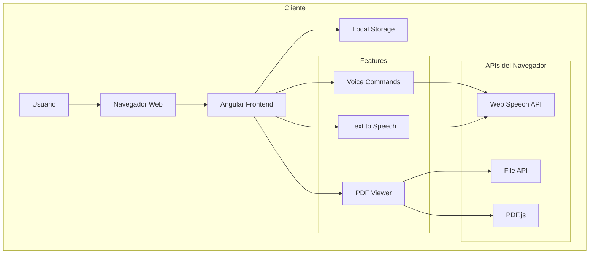
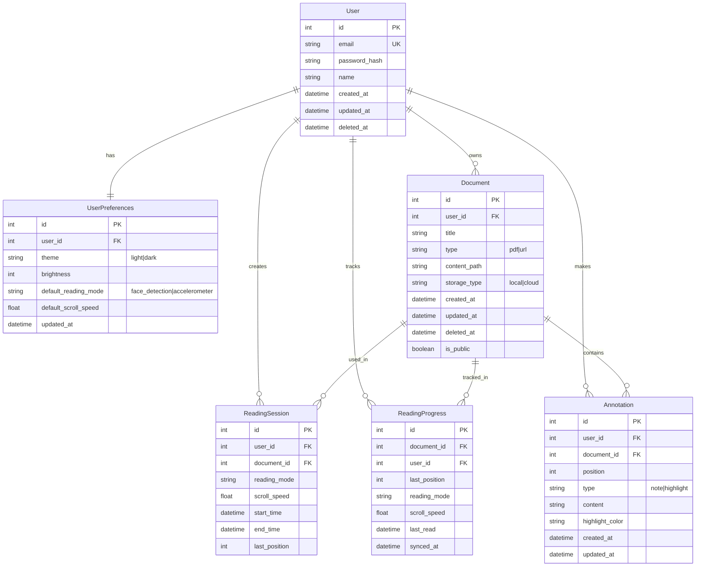

## Índice

0. [Ficha del proyecto](#0-ficha-del-proyecto)
1. [Descripción general del producto](#1-descripción-general-del-producto)
2. [Arquitectura del sistema](#2-arquitectura-del-sistema)
3. [Modelo de datos](#3-modelo-de-datos)
4. [Especificación de la API](#4-especificación-de-la-api)
5. [Historias de usuario](#5-historias-de-usuario)
6. [Tickets de trabajo](#6-tickets-de-trabajo)
7. [Pull requests](#7-pull-requests)

---

## 0. Ficha del proyecto

### **0.1. Tu nombre completo:** Luis Angel Gerónimo Vargas

### **0.2. Nombre del proyecto:** Easy Reader

### **0.3. Descripción breve del proyecto:** 
Easy Reader es una aplicación web diseñada para transformar la experiencia de lectura digital. La aplicación permite a los usuarios visualizar documentos PDF y contenido web de una manera más accesible e intuitiva. A través de diferentes modos de lectura automatizados, los usuarios pueden navegar por el contenido sin necesidad de interacción manual, lo que mejora significativamente la accesibilidad y comodidad durante la lectura.

### **0.4. URL del proyecto:**  https://easy-reader-58d6c.web.app

---

## 1. Descripción general del producto

### **1.1. Objetivo:**
Easy Reader busca revolucionar la forma en que las personas leen contenido digital en la web. El producto está diseñado para:

- Eliminar la necesidad de interacción manual constante durante la lectura
- Mejorar la accesibilidad para personas con discapacidades motoras o visuales
- Proporcionar una experiencia de lectura más natural y cómoda
- Permitir la lectura manos libres en diferentes contextos (ej. mientras se ejercita, cocina, etc.)

### **1.2. Características y funcionalidades principales:**

1. **Carga y visualización de documentos**
   - Carga de archivos PDF
   - Visualización optimizada de documentos
   - Navegación por páginas
   - Desplazamiento vertical del contenido


2. **Control por comandos de voz**
   - Navegación entre páginas mediante comandos en español
   - Control de desplazamiento (arriba/abajo)
   - Comandos para ir al inicio o final de página
   - Múltiples variantes de comandos para mayor accesibilidad
   - Feedback visual del estado del micrófono
   - Indicadores visuales de comandos reconocidos
   - Lista de comandos disponibles

3. **Síntesis de voz**
   - Lectura automática del contenido
   - Selección de voces disponibles
   - Control de velocidad de lectura
   - Controles de reproducción (play/pause)
   - Indicadores visuales del estado de lectura
   - Configuración de preferencias de voz

4. **Interfaz accesible**
   - Diseño responsivo para diferentes dispositivos
   - Controles intuitivos y bien organizados
   - Feedback visual para todas las acciones
   - Instrucciones claras de uso
   - Modales informativos y de ayuda
   - Compatibilidad con navegadores modernos

### **1.3. Diseño y experiencia de usuario:**

Los siguientes enlaces son videos almacenadas en Google Drive que muestran el diseño y le funcionamiento de la aplicación. Si no puedes acceder a ellos, por favor contáctame.

- **Desktop**
   -  https://drive.google.com/file/d/1AX1nVv3U3d6O9b7Py-pt0KZaEH-3BbSK/view?usp=sharing

- **Mobile**
   - https://drive.google.com/file/d/1UmmPXpWdg0F0wG4jRlntbBNS7eQj_asA/view?usp=drive_link

### **1.4. Instrucciones de instalación:**
Para instalar y ejecutar el proyecto localmente, sigue estos pasos:

1. **Frontend (Angular)**
   ```bash
   
   cd frontend/easy-reader

   # Instalar dependencias
   npm install

   # Iniciar el servidor de desarrollo
   npm start
   ```
   El frontend estará disponible en `https://localhost:4200`


---

## 2. Arquitectura del Sistema

### **2.1. Diagrama de arquitectura:**



La arquitectura de Easy Reader sigue un modelo centrado en el cliente-servidor con las siguientes características y justificaciones:

**Frontend (Cliente)**
- **Angular**: 
  - Uso de standalone components para mejor modularidad
  - Arquitectura por features para mejor organización
  - Sistema de routing para navegación
- **APIs del navegador**:
  - Web Speech API para comandos de voz y síntesis
   - DeviceOrientation API para el acelerómetro

**Backend (Servidor)**
- **Node.js**: Seleccionado por su eficiencia en operaciones I/O y gran ecosistema
- **Prisma ORM**: Facilita el manejo de la base de datos con type-safety
- **PostgreSQL**: Base de datos robusta para almacenar datos de usuarios y documentos

**Beneficios de esta arquitectura:**
1. **Escalabilidad**: Separación clara de responsabilidades
2. **Rendimiento**: Procesamiento en cliente para funciones en tiempo real
3. **Mantenibilidad**: Stack tecnológico moderno y bien documentado
4. **Seguridad**: Separación clara entre cliente y servidor
5. **Simplicidad**: Arquitectura centrada en el cliente
6. **Accesibilidad**: Uso directo de APIs nativas del navegador

**Sacrificios/Limitaciones:**
1. Sin persistencia de datos entre sesiones
2. Limitado al almacenamiento local del navegador
3. Sin sincronización entre dispositivos
4. Dependencia de APIs modernas del navegador

**Futuras Expansiones:**
1. Implementación de backend para usuarios registrados
2. Sistema de almacenamiento en la nube
3. Sincronización entre dispositivos
4. APIs adicionales para nuevos modos de control

### **2.2. Descripción de componentes principales:**

### **2.2. Descripción de componentes principales:**

1. **Frontend (Angular) - Implementación Actual**
   
   - **Módulo Features/Reader**
     - **PdfContentComponent**
       - Visualización de documentos PDF
       - Control de zoom y ajuste de página
       - Manejo de eventos de scroll
       - Integración con PDF.js
     
     - **ReaderControlComponent**
       - Barra de control principal
       - Gestión de modos de lectura
       - Interfaz adaptativa (colapsable/expandible)
       - Integración con controles de voz
     
     - **ReadingOptionsComponent**
       - Selección inicial de modo de lectura
       - Validación de capacidades del dispositivo
       - Configuración inicial de lectura
     
     - **VoiceCommandComponent**
       - Sistema de reconocimiento de voz
       - Gestión de estados del micrófono
       - Modal de instrucciones de comandos
       - Modal de lista de comandos disponibles
       - Feedback visual de estados y comandos
       - Soporte multilenguaje (en desarrollo)
     
     - **VoiceReaderComponent**
       - Sistema de síntesis de voz
       - Selección y gestión de voces
       - Control de velocidad de lectura
       - Controles de reproducción
       - Modal de configuración de voz
       - Indicadores de estado de lectura


 

2. **APIs del Navegador - Implementación Actual**
   - **Web Speech API**
     - SpeechRecognition
       - Reconocimiento continuo de voz
       - Gramática de comandos en español
       - Manejo de estados y eventos
     
     - SpeechSynthesis
       - Síntesis de texto a voz
       - Gestión de voces disponibles
       - Control de reproducción
   
   - **File API**
     - Carga de archivos PDF
     - Validación de tipos de archivo
     - Almacenamiento local
   
   - **PDF.js**
     - Renderizado de documentos PDF
     - Navegación entre páginas
     - Extracción de texto
     - Control de zoom y vista

3. **Backend (Node.js) - Implementación Futura**
   - **API REST**
     - Sistema de autenticación de usuarios
     - Gestión de documentos en la nube
     - Sincronización de preferencias
   
   - **Servicios Core**
     - Gestión de usuarios y perfiles
     - Almacenamiento de documentos
     - Sistema de respaldo

4. **Base de Datos (PostgreSQL) - Implementación Futura**
   - **Gestión de Usuarios**
     - Perfiles de usuario
     - Preferencias personalizadas
     - Historial de lectura
   
   - **Gestión de Documentos**
     - Biblioteca personal
     - Marcadores y anotaciones
     - Progreso de lectura
   
   - **Características Adicionales**
     - Sincronización entre dispositivos
     - Sistema de respaldo
     - Estadísticas de uso

5. **APIs Adicionales - Implementación Futura**
   - **Acelerómetro**
     - Control por inclinación
     - Ajuste de sensibilidad
   - **Detección Facial**
     - Control mediante movimientos
     - Tracking en tiempo real
   
   

### **2.3. Descripción de alto nivel del proyecto y estructura de ficheros**

El proyecto sigue una arquitectura modular organizada por features (características), donde cada feature es independiente y contiene todos los componentes necesarios para su funcionamiento. La estructura de ficheros es la siguiente:

```
easy-reader/
├── frontend/                 
│   ├── src/
│   │   ├── app/
│   │   │   ├── core/        # Servicios y guardias core
│   │   │   │   ├── interceptors/
│   │   │   │   ├── guards/
│   │   │   │   └── services/
│   │   │   ├── features/    # Módulos funcionales
│   │   │   │   ├── auth/    # Módulo de autenticación
│   │   │   │   │   ├── pages/
│   │   │   │   │   │   ├── login/
│   │   │   │   │   │   ├── register/
│   │   │   │   │   │   └── forgot-password/
│   │   │   │   │   ├── components/
│   │   │   │   │   ├── services/
│   │   │   │   │   └── models/
│   │   │   │   │
│   │   │   │   ├── reader/  # Módulo de lectura
│   │   │   │   │   ├── pages/
│   │   │   │   │   │   ├── pdf-viewer/
│   │   │   │   │   │   └── web-viewer/
│   │   │   │   │   ├── components/
│   │   │   │   │   │   ├── voice-command/
│   │   │   │   │   │   ├── voice-reader/
│   │   │   │   │   │   ├── reader-control/
│   │   │   │   │   │   ├── pdf-content/
│   │   │   │   │   │   ├── url-reader/
│   │   │   │   │   │   ├── url-viewer/
│   │   │   │   │   │   ├── reading-options/
│   │   │   │   │   │   └── pdf-uploader/
│   │   │   │   │   ├── services/
│   │   │   │   │   └── models/
│   │   │   │   │
│   │   │   │   └── dashboard/  # Módulo de dashboard
│   │   │   │   │   ├── pages/
│   │   │   │   │   │   ├── document-list/
│   │   │   │   │   │   └── reading-history/
│   │   │   │   │   ├── components/
│   │   │   │   │   ├── services/
│   │   │   │   │   └── models/
│   │   │   │   │
│   │   │   │   └── profile/  # Módulo de perfil
│   │   │   │       ├── pages/
│   │   │   │       ├── components/
│   │   │   │       ├── services/
│   │   │   │       └── models/
│   │   │   │
│   │   │   └── shared/      # Componentes y utilidades compartidas
│   │   │       ├── components/
│   │   │       ├── directives/
│   │   │       └── pipes/
│   │   ├── assets/
│   │   └── environments/
│   └── tests/
│
├── backend/                  
│   ├── src/
│   │   ├── features/        # Features del backend
│   │   │   ├── auth/
│   │   │   │   ├── controllers/
│   │   │   │   ├── services/
│   │   │   │   └── models/
│   │   │   ├── documents/
│   │   │   └── users/
│   │   │   ├── shared/
│   │   │   └── config/
│   │   ├── prisma/
│   │   └── tests/
│   │
│   └── docs/
│
└── docker/
```

**Patrones y Decisiones Arquitectónicas:**

1. **Arquitectura por Features**
   - Cada feature es un módulo independiente
   - Contiene sus propias páginas, componentes, servicios y modelos
   - Lazy loading por feature para optimización
   - Separación clara de responsabilidades

2. **Estructura de Feature**
   - **pages/**: Componentes de página (smart components)
   - **components/**: Componentes presentacionales (dumb components)
   - **services/**: Lógica de negocio y comunicación con API
   - **models/**: Interfaces y tipos de datos

3. **Core y Shared**
   - Core: Servicios singleton y lógica central
   - Shared: Componentes y utilidades reutilizables

4. **Backend por Features**
   - Organización similar al frontend
   - Separación por dominio de negocio
   - Principios SOLID y Clean Architecture

### **2.4. Infraestructura y despliegue**

El proyecto utiliza Firebase para el despliegue de la aplicación. La configuración de Firebase se encuentra en el archivo `firebase.json`, que especifica los detalles del hosting. A continuación, se describen los aspectos clave de la infraestructura y despliegue:

- **Hosting**: La aplicación se despliega en Firebase Hosting. La carpeta pública para el despliegue es `dist/easy-reader/browser`, que contiene los archivos generados después de compilar el proyecto Angular.
- **Archivos ignorados**: Durante el despliegue, se ignoran ciertos archivos y directorios, como `firebase.json`, archivos ocultos (`**/.*`), y la carpeta `node_modules`.

Esta configuración asegura que solo los archivos necesarios para la ejecución de la aplicación se incluyan en el despliegue, optimizando así el rendimiento y la seguridad del entorno de producción.

## Comandos:

1. ng build --configuration=production
2. firebase deploy 


### **2.5. Seguridad**

En el proyecto Easy Reader, se han implementado varias prácticas de seguridad para proteger los datos de los usuarios y asegurar la integridad de la aplicación:

- **Autenticación y Autorización**: Aunque actualmente el proyecto no requiere registro, se planea implementar un sistema de autenticación seguro utilizando Firebase Authentication, que proporcionará métodos de inicio de sesión seguros y gestionará las sesiones de usuario.

- **Reglas de Seguridad en Firebase**: Se han configurado reglas de seguridad en Firebase para controlar el acceso a la base de datos y al almacenamiento. Estas reglas aseguran que solo los usuarios autenticados puedan acceder a sus propios datos.

- **CORS (Cross-Origin Resource Sharing)**: La aplicación está configurada para permitir solo solicitudes de orígenes específicos, reduciendo el riesgo de ataques de tipo CSRF (Cross-Site Request Forgery).

- **Protección contra XSS (Cross-Site Scripting)**: Angular proporciona protección contra XSS de forma predeterminada al escapar automáticamente los datos vinculados en las plantillas. Esto ayuda a prevenir la inyección de scripts maliciosos.

- **Uso de HTTPS**: La aplicación se despliega utilizando HTTPS, asegurando que los datos transmitidos entre el cliente y el servidor estén cifrados.

- **Validación de Entradas**: Se implementa la validación de entradas tanto en el cliente como en el servidor para prevenir inyecciones de código y asegurar que los datos sean del tipo esperado.

- **Gestión de Sesiones**: Las sesiones de usuario se gestionan de manera segura, con tokens de acceso que tienen un tiempo de expiración limitado y se renuevan automáticamente.

Si deseas añadir o modificar algún punto específico, házmelo saber.

### **2.6. Tests**

En este proyecto, se han implementado pruebas unitarias para asegurar la funcionalidad y estabilidad de los componentes principales. A continuación, se describen algunos de los tests realizados:

- **PdfUploaderComponent:**
  - **Carga de Archivos:** Se verifica que el componente pueda manejar la carga de archivos PDF correctamente, actualizando el estado del archivo actual.
  - **Eliminación de Archivos:** Se asegura que el componente pueda eliminar el archivo cargado y restablecer el estado.

- **PdfContentComponent:**
  - **Renderizado de Páginas:** Se comprueba que el componente pueda cargar y renderizar páginas de un documento PDF, manejando la navegación entre páginas.

- **ReaderControlComponent:**
  - **Gestión de Modo de Lectura:** Se verifica que el componente pueda gestionar y cambiar entre diferentes modos de lectura, interactuando con los servicios de contenido PDF y web.

- **ReadingOptionsComponent:**
  - **Detección de Dispositivo:** Se comprueba que el componente pueda detectar si el dispositivo es móvil y si tiene un acelerómetro.
  - **Selección de Modo de Lectura:** Se asegura que el componente emita correctamente el modo de lectura seleccionado y que inicialice el visor correspondiente.

- **VoiceReaderComponent:**
  - **Inicio y Pausa de Lectura:** Se verifica que el componente pueda iniciar y pausar la lectura correctamente.
  - **Configuración de Voz:** Se comprueba que el componente pueda abrir y cerrar el modal de configuración de voz.

- **VoiceCommandComponent:**
  - **Inicio y Detención de Escucha:** Se asegura que el componente pueda iniciar y detener la escucha de comandos de voz.
  - **Manejo de Comandos:** Se valida que el componente maneje correctamente los comandos de voz, como "siguiente página".
  - **Estado del Micrófono:** Se comprueba que el estado del micrófono se actualice correctamente durante la escucha.


## 3. Modelo de Datos

### **3.1. Diagrama del modelo de datos:**



### **3.2. Descripción de entidades principales:**

1. **User (Usuarios)**
   - **id**: INT, PK, AUTO_INCREMENT
   - **email**: VARCHAR(255), UNIQUE, NOT NULL
   - **password_hash**: VARCHAR(255), NOT NULL
   - **name**: VARCHAR(100), NOT NULL
   - **created_at**: TIMESTAMP, NOT NULL
   - **updated_at**: TIMESTAMP
   - **deleted_at**: TIMESTAMP, NULL
   - Índices:
     - PRIMARY KEY (id)
     - UNIQUE INDEX (email)

2. **UserPreferences (Preferencias de Usuario)**
   - **id**: INT, PK, AUTO_INCREMENT
   - **user_id**: INT, FK(users.id), NOT NULL
   - **theme**: ENUM('light', 'dark'), DEFAULT 'light'
   - **brightness**: INT, DEFAULT 100
   - **default_reading_mode**: ENUM('face_detection', 'accelerometer')
   - **default_scroll_speed**: FLOAT, DEFAULT 1.0
   - **updated_at**: TIMESTAMP
   - Restricciones:
     - FK user_id REFERENCES users(id) ON DELETE CASCADE
     - UNIQUE(user_id)

3. **Document (Documentos)**
   - **id**: INT, PK, AUTO_INCREMENT
   - **user_id**: INT, FK(users.id), NULL
   - **title**: VARCHAR(255), NOT NULL
   - **type**: ENUM('pdf', 'url'), NOT NULL
   - **content_path**: VARCHAR(1000), NOT NULL
   - **storage_type**: ENUM('local', 'cloud'), NOT NULL
   - **created_at**: TIMESTAMP, NOT NULL
   - **updated_at**: TIMESTAMP
   - **deleted_at**: TIMESTAMP, NULL
   - **is_public**: BOOLEAN, DEFAULT false
   - Índices:
     - PRIMARY KEY (id)
     - INDEX (user_id, type)
   - Restricciones:
     - FK user_id REFERENCES users(id) ON DELETE SET NULL

4. **ReadingSession (Sesiones de Lectura)**
   - **id**: INT, PK, AUTO_INCREMENT
   - **user_id**: INT, FK(users.id), NOT NULL
   - **document_id**: INT, FK(documents.id), NOT NULL
   - **reading_mode**: ENUM('face_detection', 'accelerometer'), NOT NULL
   - **scroll_speed**: FLOAT, NOT NULL
   - **start_time**: TIMESTAMP, NOT NULL
   - **end_time**: TIMESTAMP
   - **last_position**: INT, NOT NULL
   - Restricciones:
     - FK user_id REFERENCES users(id) ON DELETE CASCADE
     - FK document_id REFERENCES documents(id) ON DELETE CASCADE

5. **ReadingProgress (Progreso de Lectura)**
   - **id**: INT, PK, AUTO_INCREMENT
   - **document_id**: INT, FK(documents.id), NOT NULL
   - **user_id**: INT, FK(users.id), NOT NULL
   - **last_position**: INT, NOT NULL
   - **reading_mode**: ENUM('face_detection', 'accelerometer')
   - **scroll_speed**: FLOAT
   - **last_read**: TIMESTAMP, NOT NULL
   - **synced_at**: TIMESTAMP
   - Restricciones:
     - FK user_id REFERENCES users(id) ON DELETE CASCADE
     - FK document_id REFERENCES documents(id) ON DELETE CASCADE
     - UNIQUE(user_id, document_id)

6. **Annotation (Anotaciones y Subrayados)**
   - **id**: INT, PK, AUTO_INCREMENT
   - **user_id**: INT, FK(users.id), NOT NULL
   - **document_id**: INT, FK(documents.id), NOT NULL
   - **position**: INT, NOT NULL
   - **type**: ENUM('note', 'highlight'), NOT NULL
   - **content**: TEXT
   - **highlight_color**: VARCHAR(7)
   - **created_at**: TIMESTAMP, NOT NULL
   - **updated_at**: TIMESTAMP
   - Índices:
     - PRIMARY KEY (id)
     - INDEX (user_id, document_id)
   - Restricciones:
     - FK user_id REFERENCES users(id) ON DELETE CASCADE
     - FK document_id REFERENCES documents(id) ON DELETE CASCADE

---

## 4. Especificación de la API

> Si tu backend se comunica a través de API, describe los endpoints principales (máximo 3) en formato OpenAPI. Opcionalmente puedes añadir un ejemplo de petición y de respuesta para mayor claridad

---

## 5. Historias de Usuario

### **Historia de Usuario 1: Lectura con Comandos de Voz**

**Como** usuario que desea controlar la lectura de documentos sin usar las manos  
**Quiero** utilizar comandos de voz para navegar y controlar el contenido  
**Para** tener una experiencia de lectura más accesible y cómoda

**Criterios de Aceptación:**
1. **DADO** que estoy en la aplicación web  
   **CUANDO** selecciono un archivo PDF o ingreso una URL  
   **ENTONCES** el sistema debe validar y cargar el documento correctamente

2. **DADO** que el documento está cargado  
   **CUANDO** selecciono el modo "Comandos de Voz"  
   **ENTONCES** el sistema debe solicitar permiso para acceder al micrófono y activar el reconocimiento de voz

3. **DADO** que los comandos de voz están activos  
   **CUANDO** digo "siguiente página" o "anterior"  
   **ENTONCES** el sistema debe cambiar de página según el comando

**Notas Técnicas:**
- Usar Web Speech API para reconocimiento de voz
- Implementar feedback visual para comandos reconocidos

**Métricas de Éxito:**
- Precisión de reconocimiento de voz > 80%
- Tiempo de respuesta a comandos < 3 segundos

### **Historia de Usuario 2: Lectura con Síntesis de Voz**

**Como** usuario que prefiere escuchar el contenido en lugar de leerlo  
**Quiero** que el sistema lea el texto en voz alta  
**Para** poder consumir el contenido sin necesidad de leerlo visualmente

**Criterios de Aceptación:**
1. **DADO** que estoy visualizando un documento  
   **CUANDO** activo la función de síntesis de voz  
   **ENTONCES** el sistema debe comenzar a leer el texto en voz alta

2. **DADO** que la lectura está en curso  
   **CUANDO** pauso o reanudo la lectura  
   **ENTONCES** el sistema debe responder inmediatamente a mis comandos

3. **DADO** que estoy usando la síntesis de voz  
   **CUANDO** ajusto la velocidad de lectura  
   **ENTONCES** el sistema debe reflejar el cambio inmediatamente

**Notas Técnicas:**
- Usar Speech Synthesis API para lectura de texto
- Permitir selección de diferentes voces y velocidades

**Métricas de Éxito:**
- Tiempo de inicio de lectura < 3 segundos
- Satisfacción del usuario > 3/5 en encuestas

### **Historia de Usuario 3: Visualizador de Contenidos**

**Como** usuario que desea acceder a documentos y contenido web de manera eficiente  
**Quiero** poder cargar y visualizar archivos PDF y URLs de manera fluida  
**Para** tener una experiencia de lectura optimizada y accesible

**Criterios de Aceptación:**
1. **DADO** que estoy en la aplicación web  
   **CUANDO** selecciono un archivo PDF o ingreso una URL  
   **ENTONCES** el sistema debe validar y cargar el contenido correctamente

2. **DADO** que el contenido está cargado  
   **CUANDO** navego por las páginas o secciones  
   **ENTONCES** el sistema debe permitir un desplazamiento suave y rápido

3. **DADO** que estoy visualizando un documento o contenido web  
   **CUANDO** cierro la aplicación y vuelvo más tarde  
   **ENTONCES** el sistema debe recordar mi última posición de lectura

**Notas Técnicas:**
- Usar File API para manejo de PDFs
- Implementar Web Storage para documentos locales
- Límite de 100MB para almacenamiento local
- Implementar limpieza automática de caché

**Métricas de Éxito:**
- Tiempo de carga de PDF < 3 segundos
- Tasa de conversión a usuarios registrados > 20%
- Retención de usuarios sin registro > 40% después de 1 semana

---

## 6. Tickets de Trabajo

### **Ticket Frontend #1: Implementar Control por Comandos de Voz**

**Tipo:** Feature Frontend  
**Prioridad:** Alta  
**Estimación:** 15 Story Points  
**Historia de Usuario:** HU1 - Lectura con Comandos de Voz

**Descripción:**  
Implementar el sistema de control por comandos de voz que permitirá a los usuarios navegar y controlar la lectura de documentos sin usar las manos. Este sistema debe ser capaz de reconocer comandos en múltiples idiomas.

**Tareas:**
1. Integrar Web Speech API para reconocimiento de voz.
2. Desarrollar interfaz de usuario para activar/desactivar comandos de voz.
3. Implementar feedback visual para comandos reconocidos.
4. Configurar gramática de comandos.
5. Mostar instrucciones de uso.
6. Permitir ver la lista de comandos aceptados.
7. Soporte para múltiples idiomas.

**Criterios de Aceptación:**
- [ ] Reconocimiento de voz preciso con latencia < 1 segundo.
- [ ] Feedback visual claro para cada comando reconocido.
- [ ] Soporte para comandos de navegación básicos (siguiente, anterior, arriba, abajo).
- [ ] Soporte para comandos personalizados por el usuario.

---

### **Ticket Frontend #2: Implementar Síntesis de Voz**

**Tipo:** Feature Frontend  
**Prioridad:** Alta  
**Estimación:** 12 Story Points  
**Historia de Usuario:** HU2 - Lectura con Síntesis de Voz

**Descripción:**  
Desarrollar la funcionalidad de síntesis de voz que permitirá a los usuarios escuchar el contenido de los documentos. La funcionalidad debe incluir opciones avanzadas de personalización de voz y velocidad, así como un sistema de feedback auditivo.

**Tareas:**
1. Integrar Speech Synthesis API para lectura de texto.
2. Permitir selección de diferentes voces y velocidades.
3. Desarrollar controles de reproducción (play/pause).
4. Implementar indicadores visuales del estado de lectura.
5. Integrar sistema de personalización de voces basado en preferencias del usuario.

**Criterios de Aceptación:**
- [ ] Inicio de lectura en < 3 segundos.
- [ ] Controles de reproducción funcionales.
- [ ] Personalización de voz y velocidad según preferencias del usuario.

---

### **Ticket Frontend #3: Desarrollar Visualizador de Contenidos**

**Tipo:** Feature Frontend  
**Prioridad:** Media  
**Estimación:** 10 Story Points  
**Historia de Usuario:** HU3 - Visualización de Contenidos

**Descripción:**  
Desarrollar un visualizador de contenidos que permita a los usuarios cargar y visualizar documentos PDF y contenido web de manera eficiente. El visualizador debe ser capaz de manejar documentos de gran tamaño y ofrecer una experiencia de usuario fluida.

**Tareas:**
1. Implementar visualizador de PDF utilizando PDF.js.
2. Desarrollar interfaz de usuario intuitiva para navegación de documentos.
3. Optimizar rendimiento para documentos de gran tamaño.
4. Soporte para visualización de contenido web.

**Criterios de Aceptación:**
- [ ] Carga de documentos en < 3 segundos.
- [ ] Interfaz de usuario intuitiva y fácil de usar.
- [ ] Soporte para documentos de gran tamaño sin pérdida de rendimiento.

---

## 7. Pull Requests

### Easy Reader - Primera Versión

#### Descripción General
Este PR representa la primera versión de Easy Reader, una aplicación web diseñada para mejorar la experiencia de lectura digital. El proyecto se enfoca en hacer la lectura más accesible y personalizable para todos los usuarios.

#### Características Principales
- Interfaz de usuario intuitiva y moderna
- Lector de voz integrado con controles personalizables
- Diseño totalmente responsivo

#### Implementación Técnica
##### Frontend
- Desarrollo en Angular
- Arquitectura modular y escalable
- Componentes reutilizables
- Estilos SCSS personalizados
- Integración con APIs de síntesis de voz

#### Documentación
- Documentación técnica del proyecto (PRD)
- Pantilla (@template.md) con el formato esperado.

#### Próximos Pasos
- Implementación de características adicionales
- Optimizaciones de rendimiento
- Mejoras en la accesibilidad
- Expansión de opciones de personalización

---

### Easy Reader - Comandos de Voz y Mejoras de Accesibilidad

#### Descripción General
Este PR añade funcionalidades avanzadas de control por voz a Easy Reader, mejorando significativamente la accesibilidad y la experiencia de usuario. Se implementa un sistema completo de comandos de voz que permite la navegación y control del documento sin necesidad de interacción física.

#### Características Principales
- Sistema de comandos de voz
- Interfaz modal para visualización de comandos disponibles
- Feedback visual en tiempo real de los comandos reconocidos
- Navegación por voz del documento (siguiente, anterior, arriba, abajo)
- Control de desplazamiento mediante comandos
- Soporte para múltiples variantes de comandos en español

#### Implementación Técnica
##### Componentes Nuevos
- VoiceCommandComponent para gestión de comandos de voz
- Sistema de modales para instrucciones y lista de comandos
- Integración con Web Speech API
- Manejo de estados del micrófono y feedback visual

##### Mejoras
- Diseño responsivo para los nuevos componentes
- Sistema de overlay para modales
- Estructura organizada de comandos por idioma
- Feedback visual mejorado para interacciones de usuario

#### Documentación
- Documentación de comandos de voz disponibles
- Guía de uso del sistema de voz
- Instrucciones de implementación

#### Próximos Pasos
- Mejoras en el reconocimiento de voz
- Personalización de comandos
- Expansión a otros idiomas


### Easy Reader - Integración de Autenticación con Google y Mejoras de Diseño

#### Descripción General
Este PR implementa el sistema de autenticación con Google y realiza importantes mejoras en el diseño general de Easy Reader. Ahora los usuarios pueden acceder de forma segura y rápida utilizando sus cuentas de Google, además de disfrutar de una interfaz más intuitiva y estéticamente mejorada.

#### Características Principales
- Inicio de sesión con Google mediante Firebase Authentication
- Perfil de usuario personalizado con foto e información básica
- Interfaz de usuario rediseñada con enfoque en accesibilidad y estética
- Transiciones y animaciones suaves para mejorar la experiencia

#### Implementación Técnica
##### Componentes Nuevos
- AuthComponent para gestión de la autenticación
- UserProfileComponent para visualización y gestión del perfil
- Integración con Firebase Authentication y Google Sign-In
- Sistema de almacenamiento de preferencias en Firebase

#### Mejoras de Diseño
- Paleta de colores actualizada y consistente
- Elementos de interfaz con mayor contraste para accesibilidad
- Diseño responsivo optimizado para dispositivos móviles y de escritorio
- Iconografía mejorada y consistente en toda la aplicación
- Componentes visuales reutilizables con animaciones sutiles

#### Próximos Pasos
- Integración con google drive
- Gestion de documentos 
- Sincronización de documentos entre dispositivos
- Mejoras adicionales en la personalización de la interfaz de usuario
- Métricas de uso y analíticas para usuarios identificados
