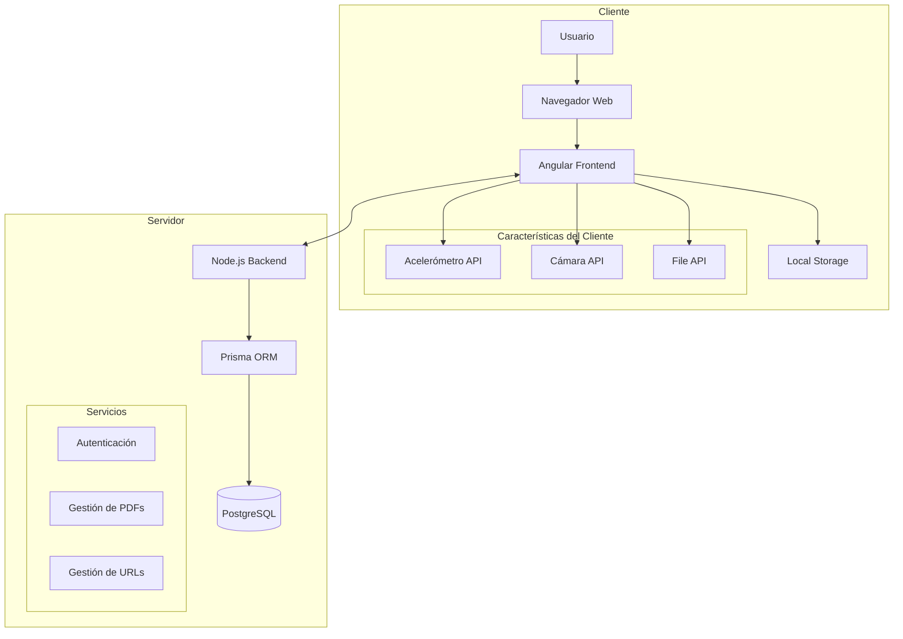
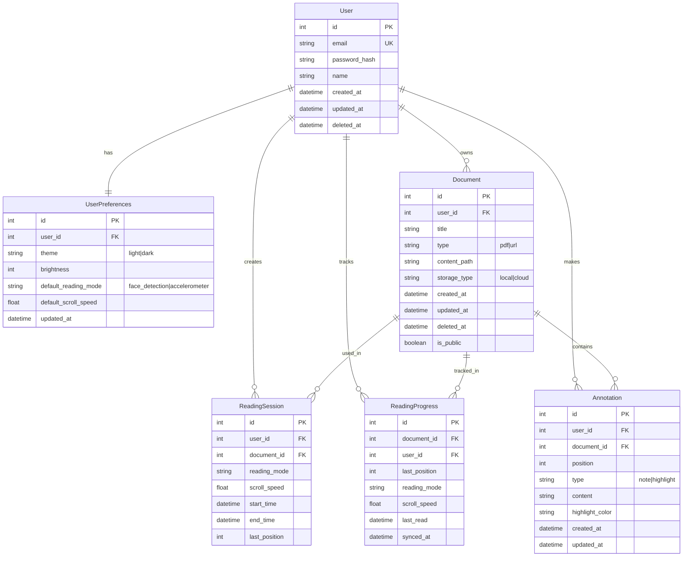

## Índice

0. [Ficha del proyecto](#0-ficha-del-proyecto)
1. [Descripción general del producto](#1-descripción-general-del-producto)
2. [Arquitectura del sistema](#2-arquitectura-del-sistema)
3. [Modelo de datos](#3-modelo-de-datos)
4. [Especificación de la API](#4-especificación-de-la-api)
5. [Historias de usuario](#5-historias-de-usuario)
6. [Tickets de trabajo](#6-tickets-de-trabajo)
7. [Pull requests](#7-pull-requests)

---

## 0. Ficha del proyecto

### **0.1. Tu nombre completo:** Luis Angel Gerónimo Vargas

### **0.2. Nombre del proyecto:** Easy Reader

### **0.3. Descripción breve del proyecto:** 
Easy Reader es una aplicación web que mejora la experiencia de lectura en dispositivos móviles mediante desplazamiento automático inteligente. Permite a los usuarios cargar PDFs o URLs y controlar la navegación a través del acelerómetro del dispositivo o detección facial, haciendo la lectura más accesible y cómoda, especialmente para personas con discapacidades motoras.

### **0.4. URL del proyecto:**

> Puede ser pública o privada, en cuyo caso deberás compartir los accesos de manera segura. Puedes enviarlos a [alvaro@lidr.co](mailto:alvaro@lidr.co) usando algún servicio como [onetimesecret](https://onetimesecret.com/).

### 0.5. URL o archivo comprimido del repositorio

> Puedes tenerlo alojado en público o en privado, en cuyo caso deberás compartir los accesos de manera segura. Puedes enviarlos a [alvaro@lidr.co](mailto:alvaro@lidr.co) usando algún servicio como [onetimesecret](https://onetimesecret.com/). También puedes compartir por correo un archivo zip con el contenido


---

## 1. Descripción general del producto

### **1.1. Objetivo:**
Easy Reader busca revolucionar la forma en que las personas leen contenido digital en dispositivos móviles. El producto está diseñado para:

- Eliminar la necesidad de interacción manual constante durante la lectura
- Mejorar la accesibilidad para personas con discapacidades motoras o visuales
- Proporcionar una experiencia de lectura más natural y cómoda
- Permitir la lectura manos libres en diferentes contextos (ej. mientras se ejercita, cocina, etc.)

### **1.2. Características y funcionalidades principales:**

1. **Carga de contenido flexible**
   - Subida de archivos PDF
   - Ingreso de URLs para lectura de contenido web
   - Almacenamiento local para usuarios sin registro
   - Guardado en la nube para usuarios registrados

2. **Modos de lectura inteligente**
   - Control mediante acelerómetro del dispositivo
   - Control mediante detección facial
   - Ajuste de velocidad de desplazamiento
   - Capacidad de pausa/continuación

3. **Sistema de usuarios**
   - Modo sin registro con funcionalidades básicas
   - Modo registrado con características adicionales:
     - Guardado de documentos
     - Sincronización entre dispositivos
     - Progreso de lectura guardado

4. **Características de accesibilidad**
   - Interfaz responsiva
   - Compatibilidad con navegadores modernos
   - Diseño centrado en la accesibilidad

### **1.3. Diseño y experiencia de usuario:**

> Proporciona imágenes y/o videotutorial mostrando la experiencia del usuario desde que aterriza en la aplicación, pasando por todas las funcionalidades principales.

### **1.4. Instrucciones de instalación:**
> Documenta de manera precisa las instrucciones para instalar y poner en marcha el proyecto en local (librerías, backend, frontend, servidor, base de datos, migraciones y semillas de datos, etc.)

---

## 2. Arquitectura del Sistema

### **2.1. Diagrama de arquitectura:**



La arquitectura de Easy Reader sigue un patrón cliente-servidor con las siguientes características y justificaciones:

**Frontend (Cliente)**
- **Angular**: Elegido por su robustez en aplicaciones empresariales y su arquitectura modular
- **APIs del navegador**:
  - WebRTC para acceso a la cámara
  - DeviceOrientation API para el acelerómetro
  - File API para manejo de PDFs
- **Local Storage**: Para almacenamiento sin registro

**Backend (Servidor)**
- **Node.js**: Seleccionado por su eficiencia en operaciones I/O y gran ecosistema
- **Prisma ORM**: Facilita el manejo de la base de datos con type-safety
- **PostgreSQL**: Base de datos robusta para almacenar datos de usuarios y documentos

**Beneficios de esta arquitectura:**
1. **Escalabilidad**: Separación clara de responsabilidades
2. **Rendimiento**: Procesamiento en cliente para funciones en tiempo real
3. **Mantenibilidad**: Stack tecnológico moderno y bien documentado
4. **Seguridad**: Separación clara entre cliente y servidor

**Sacrificios/Limitaciones:**
1. Complejidad inicial en la configuración
2. Requisitos de hardware para funciones de detección facial
3. Dependencia de APIs modernas del navegador

### **2.2. Descripción de componentes principales:**

1. **Frontend (Angular)**
   - **Módulo de Lectura**
     - Componente de visualización de PDF
     - Componente de visualización de contenido web
   
   - **Módulo de Control de Movimiento**
     - Servicio de detección facial
     - Servicio de acelerómetro
     - Controlador de velocidad de desplazamiento
   
   - **Módulo de Usuario**
     - Componentes de autenticación
     - Gestión de perfil
     - Dashboard de documentos

2. **Backend (Node.js)**
   - **API REST**
     - Endpoints de autenticación y autorización
     - Gestión de documentos
     - Sincronización de progreso de lectura
   
   - **Servicios Core**
     - Servicio de gestión de usuarios
     - Servicio de almacenamiento de documentos
     - Servicio de almacenamiento de URLs
   
   - **Capa de Datos (Prisma)**
     - Modelos de datos
     - Migraciones
     - Queries optimizadas

3. **Base de Datos (PostgreSQL)**
   - Almacenamiento de datos de usuarios
   - Gestión de documentos y URLs
   - Registro de progreso de lectura
   - Sistema de respaldo y recuperación

4. **APIs del Navegador**
   - **WebRTC**
     - Acceso a la cámara
     - Procesamiento de video en tiempo real
   
   - **DeviceOrientation API**
     - Detección de inclinación del dispositivo
     - Cálculo de velocidad de desplazamiento
   
   - **File API**
     - Carga y procesamiento de PDFs
     - Almacenamiento local

### **2.3. Descripción de alto nivel del proyecto y estructura de ficheros**

El proyecto sigue una arquitectura modular organizada por features (características), donde cada feature es independiente y contiene todos los componentes necesarios para su funcionamiento. La estructura de ficheros es la siguiente:

```
easy-reader/
├── frontend/                 
│   ├── src/
│   │   ├── app/
│   │   │   ├── core/        # Servicios y guardias core
│   │   │   │   ├── interceptors/
│   │   │   │   ├── guards/
│   │   │   │   └── services/
│   │   │   ├── features/    # Módulos funcionales
│   │   │   │   ├── auth/    # Módulo de autenticación
│   │   │   │   │   ├── pages/
│   │   │   │   │   │   ├── login/
│   │   │   │   │   │   ├── register/
│   │   │   │   │   │   └── forgot-password/
│   │   │   │   │   ├── components/
│   │   │   │   │   ├── services/
│   │   │   │   │   └── models/
│   │   │   │   │
│   │   │   │   ├── reader/  # Módulo de lectura
│   │   │   │   │   ├── pages/
│   │   │   │   │   │   ├── pdf-viewer/
│   │   │   │   │   │   └── web-viewer/
│   │   │   │   │   ├── components/
│   │   │   │   │   │   ├── motion-controls/
│   │   │   │   │   │   ├── face-detection/
│   │   │   │   │   │   └── reader-settings/
│   │   │   │   │   ├── services/
│   │   │   │   │   └── models/
│   │   │   │   │
│   │   │   │   ├── dashboard/  # Módulo de dashboard
│   │   │   │   │   ├── pages/
│   │   │   │   │   │   ├── document-list/
│   │   │   │   │   │   └── reading-history/
│   │   │   │   │   ├── components/
│   │   │   │   │   ├── services/
│   │   │   │   │   └── models/
│   │   │   │   │
│   │   │   │   └── profile/  # Módulo de perfil
│   │   │   │       ├── pages/
│   │   │   │       ├── components/
│   │   │   │       ├── services/
│   │   │   │       └── models/
│   │   │   │
│   │   │   └── shared/      # Componentes y utilidades compartidas
│   │   │       ├── components/
│   │   │       ├── directives/
│   │   │       └── pipes/
│   │   ├── assets/
│   │   └── environments/
│   └── tests/
│
├── backend/                  
│   ├── src/
│   │   ├── features/        # Features del backend
│   │   │   ├── auth/
│   │   │   │   ├── controllers/
│   │   │   │   ├── services/
│   │   │   │   └── models/
│   │   │   ├── documents/
│   │   │   └── users/
│   │   │   ├── shared/
│   │   │   └── config/
│   │   ├── prisma/
│   │   └── tests/
│   │
│   └── docs/
│
└── docker/
```

**Patrones y Decisiones Arquitectónicas:**

1. **Arquitectura por Features**
   - Cada feature es un módulo independiente
   - Contiene sus propias páginas, componentes, servicios y modelos
   - Lazy loading por feature para optimización
   - Separación clara de responsabilidades

2. **Estructura de Feature**
   - **pages/**: Componentes de página (smart components)
   - **components/**: Componentes presentacionales (dumb components)
   - **services/**: Lógica de negocio y comunicación con API
   - **models/**: Interfaces y tipos de datos

3. **Core y Shared**
   - Core: Servicios singleton y lógica central
   - Shared: Componentes y utilidades reutilizables

4. **Backend por Features**
   - Organización similar al frontend
   - Separación por dominio de negocio
   - Principios SOLID y Clean Architecture

### **2.4. Infraestructura y despliegue**

> Detalla la infraestructura del proyecto, incluyendo un diagrama en el formato que creas conveniente, y explica el proceso de despliegue que se sigue

### **2.5. Seguridad**

> Enumera y describe las prácticas de seguridad principales que se han implementado en el proyecto, añadiendo ejemplos si procede

### **2.6. Tests**

> Describe brevemente algunos de los tests realizados

---

## 3. Modelo de Datos

### **3.1. Diagrama del modelo de datos:**



### **3.2. Descripción de entidades principales:**

1. **User (Usuarios)**
   - **id**: INT, PK, AUTO_INCREMENT
   - **email**: VARCHAR(255), UNIQUE, NOT NULL
   - **password_hash**: VARCHAR(255), NOT NULL
   - **name**: VARCHAR(100), NOT NULL
   - **created_at**: TIMESTAMP, NOT NULL
   - **updated_at**: TIMESTAMP
   - **deleted_at**: TIMESTAMP, NULL
   - Índices:
     - PRIMARY KEY (id)
     - UNIQUE INDEX (email)

2. **UserPreferences (Preferencias de Usuario)**
   - **id**: INT, PK, AUTO_INCREMENT
   - **user_id**: INT, FK(users.id), NOT NULL
   - **theme**: ENUM('light', 'dark'), DEFAULT 'light'
   - **brightness**: INT, DEFAULT 100
   - **default_reading_mode**: ENUM('face_detection', 'accelerometer')
   - **default_scroll_speed**: FLOAT, DEFAULT 1.0
   - **updated_at**: TIMESTAMP
   - Restricciones:
     - FK user_id REFERENCES users(id) ON DELETE CASCADE
     - UNIQUE(user_id)

3. **Document (Documentos)**
   - **id**: INT, PK, AUTO_INCREMENT
   - **user_id**: INT, FK(users.id), NULL
   - **title**: VARCHAR(255), NOT NULL
   - **type**: ENUM('pdf', 'url'), NOT NULL
   - **content_path**: VARCHAR(1000), NOT NULL
   - **storage_type**: ENUM('local', 'cloud'), NOT NULL
   - **created_at**: TIMESTAMP, NOT NULL
   - **updated_at**: TIMESTAMP
   - **deleted_at**: TIMESTAMP, NULL
   - **is_public**: BOOLEAN, DEFAULT false
   - Índices:
     - PRIMARY KEY (id)
     - INDEX (user_id, type)
   - Restricciones:
     - FK user_id REFERENCES users(id) ON DELETE SET NULL

4. **ReadingSession (Sesiones de Lectura)**
   - **id**: INT, PK, AUTO_INCREMENT
   - **user_id**: INT, FK(users.id), NOT NULL
   - **document_id**: INT, FK(documents.id), NOT NULL
   - **reading_mode**: ENUM('face_detection', 'accelerometer'), NOT NULL
   - **scroll_speed**: FLOAT, NOT NULL
   - **start_time**: TIMESTAMP, NOT NULL
   - **end_time**: TIMESTAMP
   - **last_position**: INT, NOT NULL
   - Restricciones:
     - FK user_id REFERENCES users(id) ON DELETE CASCADE
     - FK document_id REFERENCES documents(id) ON DELETE CASCADE

5. **ReadingProgress (Progreso de Lectura)**
   - **id**: INT, PK, AUTO_INCREMENT
   - **document_id**: INT, FK(documents.id), NOT NULL
   - **user_id**: INT, FK(users.id), NOT NULL
   - **last_position**: INT, NOT NULL
   - **reading_mode**: ENUM('face_detection', 'accelerometer')
   - **scroll_speed**: FLOAT
   - **last_read**: TIMESTAMP, NOT NULL
   - **synced_at**: TIMESTAMP
   - Restricciones:
     - FK user_id REFERENCES users(id) ON DELETE CASCADE
     - FK document_id REFERENCES documents(id) ON DELETE CASCADE
     - UNIQUE(user_id, document_id)

6. **Annotation (Anotaciones y Subrayados)**
   - **id**: INT, PK, AUTO_INCREMENT
   - **user_id**: INT, FK(users.id), NOT NULL
   - **document_id**: INT, FK(documents.id), NOT NULL
   - **position**: INT, NOT NULL
   - **type**: ENUM('note', 'highlight'), NOT NULL
   - **content**: TEXT
   - **highlight_color**: VARCHAR(7)
   - **created_at**: TIMESTAMP, NOT NULL
   - **updated_at**: TIMESTAMP
   - Índices:
     - PRIMARY KEY (id)
     - INDEX (user_id, document_id)
   - Restricciones:
     - FK user_id REFERENCES users(id) ON DELETE CASCADE
     - FK document_id REFERENCES documents(id) ON DELETE CASCADE

---

## 4. Especificación de la API

> Si tu backend se comunica a través de API, describe los endpoints principales (máximo 3) en formato OpenAPI. Opcionalmente puedes añadir un ejemplo de petición y de respuesta para mayor claridad

---

## 5. Historias de Usuario

### **Historia de Usuario 1: Lectura Manos Libres con Detección Facial**

**Como** usuario con movilidad reducida en las manos  
**Quiero** poder controlar el desplazamiento de lectura usando los movimientos de mi cabeza  
**Para** poder leer documentos de forma independiente sin necesidad de usar las manos

**Criterios de Aceptación:**
1. **DADO** que estoy en la página de lectura de un documento  
   **CUANDO** selecciono el modo "Control por detección facial"  
   **ENTONCES** el sistema debe solicitar permiso para acceder a la cámara

2. **DADO** que he concedido acceso a la cámara  
   **CUANDO** el sistema detecta mi rostro  
   **ENTONCES** debe mostrar un indicador visual de que mi rostro está siendo detectado correctamente

3. **DADO** que el sistema está detectando mi rostro  
   **CUANDO** inclino mi cabeza hacia abajo  
   **ENTONCES** el documento debe desplazarse hacia abajo a una velocidad proporcional a la inclinación

4. **DADO** que el sistema está detectando mi rostro  
   **CUANDO** mantengo mi cabeza en posición neutral  
   **ENTONCES** el desplazamiento debe detenerse

5. **DADO** que estoy usando el control facial  
   **CUANDO** el sistema pierde la detección de mi rostro  
   **ENTONCES** debe pausar el desplazamiento y mostrar una alerta visual

**Notas Técnicas:**
- Usar WebRTC para acceso a la cámara
- Implementar TensorFlow.js para detección facial
- Calibración inicial para determinar la posición neutral
- Tasa de actualización mínima de 30fps para una experiencia fluida

**Métricas de Éxito:**
- Tiempo de respuesta < 100ms entre movimiento y desplazamiento
- Tasa de falsos positivos en detección facial < 5%
- Satisfacción del usuario > 4/5 en encuestas

### **Historia de Usuario 2: Sincronización de Progreso de Lectura**

**Como** usuario registrado  
**Quiero** que mi progreso de lectura se sincronice automáticamente entre dispositivos  
**Para** poder continuar leyendo desde donde lo dejé en cualquier dispositivo

**Criterios de Aceptación:**
1. **DADO** que soy un usuario registrado  
   **CUANDO** abro un documento previamente leído  
   **ENTONCES** el sistema debe posicionarme automáticamente en la última posición leída

2. **DADO** que estoy leyendo un documento  
   **CUANDO** cambio de página o avanzo en el documento  
   **ENTONCES** el sistema debe guardar mi progreso automáticamente

3. **DADO** que tengo una sesión activa  
   **CUANDO** pierdo conexión a internet  
   **ENTONCES** el sistema debe:
   - Guardar el progreso localmente
   - Mostrar indicador de "sin conexión"
   - Sincronizar cuando se restaure la conexión

4. **DADO** que accedo desde un nuevo dispositivo  
   **CUANDO** inicio sesión en mi cuenta  
   **ENTONCES** debo ver mi biblioteca con el progreso actualizado de cada documento

**Notas Técnicas:**
- Implementar sistema de caché local con IndexedDB
- Usar timestamps para resolver conflictos de sincronización
- Comprimir datos de progreso para optimizar almacenamiento

**Métricas de Éxito:**
- Tiempo de sincronización < 2 segundos
- Precisión de posición al reanudar > 99%
- Uso de datos móviles < 50KB por sincronización

### **Historia de Usuario 3: Gestión de Documentos sin Registro**

**Como** usuario sin cuenta  
**Quiero** poder cargar y leer documentos sin necesidad de registrarme  
**Para** evaluar la aplicación antes de crear una cuenta

**Criterios de Aceptación:**
1. **DADO** que soy un usuario sin registrar  
   **CUANDO** accedo a la página principal  
   **ENTONCES** debo ver opciones claras para:
   - Cargar PDF
   - Ingresar URL
   - Crear cuenta (opcional)

2. **DADO** que selecciono "Cargar PDF"  
   **CUANDO** subo un archivo  
   **ENTONCES** el sistema debe:
   - Validar que sea un PDF válido
   - Mostrar vista previa
   - Almacenar localmente
   - No enviar al servidor

3. **DADO** que ingreso una URL  
   **CUANDO** confirmo la entrada  
   **ENTONCES** el sistema debe:
   - Validar que la URL sea accesible
   - Extraer el contenido legible
   - Mostrar en formato optimizado para lectura

4. **DADO** que estoy leyendo un documento como usuario sin registrar  
   **CUANDO** cierro el navegador y vuelvo más tarde  
   **ENTONCES** debo poder acceder a mis documentos recientes desde el almacenamiento local

**Notas Técnicas:**
- Usar File API para manejo de PDFs
- Implementar Web Storage para documentos locales
- Límite de 100MB para almacenamiento local
- Implementar limpieza automática de caché

**Métricas de Éxito:**
- Tiempo de carga de PDF < 3 segundos
- Tasa de conversión a usuarios registrados > 20%
- Retención de usuarios sin registro > 40% después de 1 semana

---

## 6. Tickets de Trabajo

### **Ticket Frontend #1: Implementar Detector Facial para Control de Lectura**

**Tipo:** Feature Frontend  
**Prioridad:** Alta  
**Estimación:** 13 Story Points  
**Historia de Usuario:** HU1 - Lectura Manos Libres con Detección Facial

**Descripción:**  
Implementar el componente de detección facial que controlará el desplazamiento automático del documento durante la lectura.

**Tareas:**
1. Crear componente `FaceDetectionController`:
   ```typescript
   interface FaceDetectionConfig {
     calibrationTimeMs: number;
     minConfidence: number;
     updateInterval: number;
     neutralZoneAngle: number;
   }
   ```

2. Implementar detección facial usando TensorFlow.js:
   - Inicializar modelo de detección facial
   - Configurar pipeline de procesamiento de video
   - Implementar detección de ángulos de cabeza

3. Crear servicio de control de desplazamiento:
   ```typescript
   interface ScrollControl {
     speed: number;
     direction: 'up' | 'down' | 'none';
     isActive: boolean;
   }
   ```

4. Implementar UI de calibración y feedback:
   - Overlay para guía de calibración
   - Indicadores visuales de estado
   - Controles de ajuste de sensibilidad

**Criterios de Aceptación:**
- [ ] Detección facial funciona a >30fps en dispositivos móviles
- [ ] Latencia máxima de 100ms entre movimiento y respuesta
- [ ] Calibración inicial guiada para el usuario
- [ ] Indicadores visuales de estado de detección
- [ ] Manejo gracioso de pérdida de detección

**Dependencias:**
- Backend API para guardar preferencias de usuario
- Servicio de scroll del visor de documentos

**Consideraciones Técnicas:**
```typescript
// Ejemplo de implementación base
@Component({
  selector: 'app-face-detection',
  template: `
    <div class="face-detection-container">
      <video #videoElement></video>
      <canvas #debugCanvas></canvas>
      <div class="status-indicator" [class.active]="isTracking">
        <!-- Indicadores de estado -->
      </div>
    </div>
  `
})
export class FaceDetectionComponent implements OnInit, OnDestroy {
  @ViewChild('videoElement') videoElement: ElementRef<HTMLVideoElement>;
  private detector: FaceDetector;
  private calibrationData: CalibrationData;

  async initializeDetector() {
    // Implementación
  }

  calculateScrollSpeed(faceAngle: number): number {
    // Implementación
  }
}
```

### **Ticket Backend #1: API para Gestión de Progreso de Lectura**

**Tipo:** Feature Backend  
**Prioridad:** Alta  
**Estimación:** 8 Story Points  
**Historia de Usuario:** HU2 - Sincronización de Progreso de Lectura

**Descripción:**  
Implementar endpoints REST para sincronización de progreso de lectura entre dispositivos.

**Tareas:**
1. Crear controlador de progreso de lectura:
   ```typescript
   interface ReadingProgress {
     userId: number;
     documentId: number;
     position: number;
     readingMode: string;
     timestamp: Date;
   }
   ```

2. Implementar endpoints:
   - GET /api/reading-progress/:documentId
   - POST /api/reading-progress
   - PUT /api/reading-progress/:id

3. Implementar servicio de sincronización:
   - Manejo de conflictos por timestamp
   - Validación de datos
   - Caché de últimas posiciones

**Criterios de Aceptación:**
- [ ] Endpoints documentados con OpenAPI
- [ ] Tests unitarios con >90% cobertura
- [ ] Validación de datos y manejo de errores
- [ ] Respuesta máxima de 200ms
- [ ] Logging de operaciones críticas

**SQL y Migraciones:**
```sql
-- Ejemplo de queries principales
CREATE INDEX idx_reading_progress_user_doc 
ON reading_progress(user_id, document_id);

-- Query de último progreso
SELECT rp.* FROM reading_progress rp
WHERE rp.user_id = ? AND rp.document_id = ?
ORDER BY rp.timestamp DESC LIMIT 1;
```

### **Ticket Database #1: Optimización de Queries de Lectura**

**Tipo:** Database Optimization  
**Prioridad:** Alta  
**Estimación:** 5 Story Points  
**Historia de Usuario:** HU2 - Sincronización de Progreso de Lectura

**Descripción:**  
Optimizar el esquema y queries de la base de datos para mejorar el rendimiento de las operaciones de lectura y sincronización.

**Tareas:**
1. Crear índices optimizados:
```sql
-- Índices para búsqueda rápida de progreso
CREATE INDEX idx_reading_progress_composite 
ON reading_progress(user_id, document_id, timestamp);

-- Índice para documentos recientes
CREATE INDEX idx_documents_recent 
ON documents(user_id, updated_at);
```

2. Implementar particionamiento de tabla reading_progress:
```sql
-- Particionar por rango de fechas
CREATE TABLE reading_progress (
    id SERIAL,
    user_id INT,
    document_id INT,
    position INT,
    timestamp TIMESTAMP
) PARTITION BY RANGE (timestamp);

-- Crear particiones
CREATE TABLE reading_progress_current PARTITION OF reading_progress
FOR VALUES FROM ('2024-01-01') TO ('2024-12-31');
```

3. Optimizar queries frecuentes:
   - Análisis de plan de ejecución
   - Implementación de vistas materializadas
   - Configuración de caché de queries

**Criterios de Aceptación:**
- [ ] Tiempo de respuesta <50ms para queries frecuentes
- [ ] Plan de ejecución optimizado verificado
- [ ] Scripts de mantenimiento automatizados
- [ ] Documentación de índices y particiones
- [ ] Plan de backup para nuevas estructuras

**Consideraciones Técnicas:**
- Mantener estadísticas actualizadas
- Monitorear tamaño de índices
- Verificar impacto en escrituras
- Plan de purga de datos antiguos

---

## 7. Pull Requests

> Documenta 3 de las Pull Requests realizadas durante la ejecución del proyecto

**Pull Request 1**

**Pull Request 2**

**Pull Request 3**

